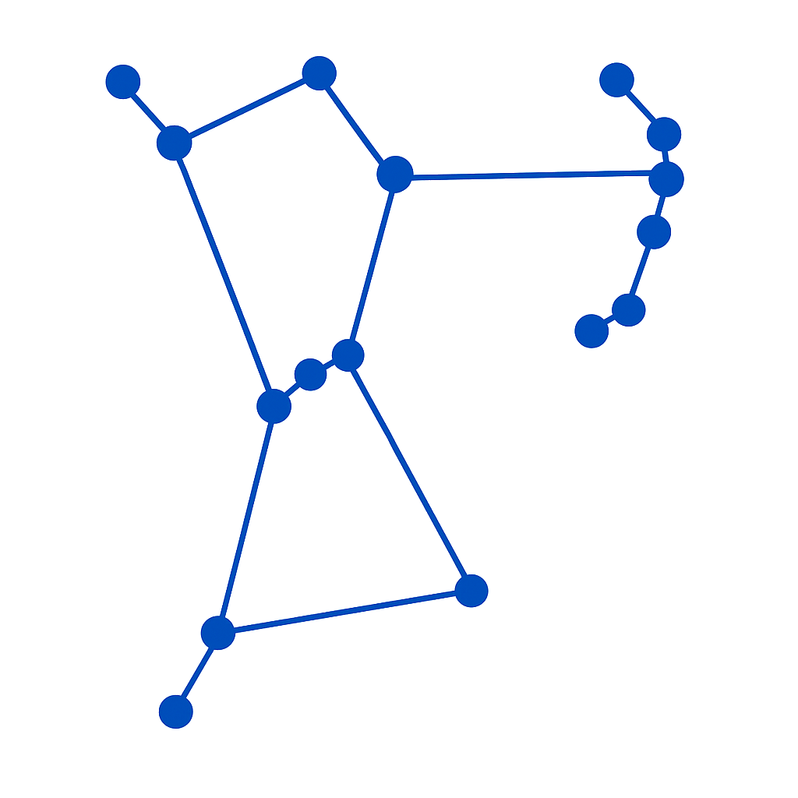

# ORION — Optimized Rule Integration & Operations Native

[](CONTRIBUTING.md)
[](https://github.com/omnixs/orion/releases/latest)
[](LICENSE)
[](https://github.com/omnixs/orion/actions/workflows/ci-full.yml)
[](https://en.cppreference.com/w/cpp/23)
[](https://www.omg.org/spec/DMN/)
[](dat/tck-baselines/1.0.0/)



A native C++ implementation of the DMN™ (Decision Model and Notation) specification,
focusing on **decision tables** with an emphasis on performance, correctness, and simple integration.

> **🤖 AI-Generated Project:** All source code is generated by AI agents via task prompts. See [AI-Only Development Workflow](#ai-only-development-workflow) below.

- **Language:** C++23
- **License:** Apache-2.0 (see `LICENSE`)
- **Status:** Early stage (APIs may evolve)
- **DMN Compliance:** Level 1 and Level 2 compatible
- **Goals:** fast rule evaluation, clean table model, clear extensibility points

## Why Orion?

- **Native C++23** - No JVM dependency, designed for high-performance backend integration
- **DMN Standards Focus** - Implements DMN 1.5 Level 2 with 100% TCK compliance (126/126 tests)
- **Lightweight & Embeddable** - Static library suitable for embedding in larger systems
- **Production-Quality Testing** - 3,814 automated tests (279 unit + 3,535 TCK)
- **AI-Only Codebase** - Demonstrates rigorous AI-generated code with human oversight

## Download

Download the latest release from [GitHub Releases](https://github.com/omnixs/orion/releases/latest):

- **Linux**: `orion-X.Y.Z-linux-x64.tar.gz`
- **Windows**: `orion-X.Y.Z-windows-x64.zip`

Each release includes:
- Static libraries (`liborion_lib.a` / `orion_lib.lib`)
- Headers (`include/orion/`)
- CMake configuration files
- Command-line tools (`orion_app`, `orion_tck_runner`)
- TCK test baseline for the version
- License files

**Verify downloads** with the corresponding `.sha256` checksum files.

## Features

- Decision Table evaluation compatible with DMN L1/L2 (hit policies, FEEL expressions)
- Business Knowledge Models (BKM) support
- Portable C++ API under `orion::api` namespace
- FEEL (Friendly Enough Expression Language) expression evaluator
- Pluggable logger interface (optional spdlog integration)
- Deterministic tests and benchmarks
- DMN TCK (Technology Compatibility Kit) test runner

## Current Limitations

**DMN Feature Coverage:**
- ✅ Level 2: 100% (126/126 tests) - Decision tables with UNIQUE, FIRST, COLLECT hit policies
- ⏳ Level 3: 13.7% (484/3,535 tests) - Partial FEEL expression support
- ❌ Boxed expressions, decision services, and advanced DMN features not yet implemented

**FEEL Language Support:**
- ✅ Basic arithmetic, comparisons, boolean logic, string operations
- ✅ Built-in functions: abs(), substring(), string length, matches()
- ⏳ Limited date/time, list, and context operations
- ❌ Advanced functions, quantified expressions (some, every)

**API Stability:**
- Version 1.0.1 released: Stable API with semantic versioning
- Thread-safety: Single-threaded usage model (share-nothing across threads)
- See [CHANGELOG.md](CHANGELOG.md) for version history

## Quick Start

### Prerequisites

- C++23 compatible compiler (GCC 11+, Clang 15+, MSVC 2022+)
- CMake 3.26 or later
- vcpkg package manager

### Setup vcpkg

```bash
git clone https://github.com/Microsoft/vcpkg.git ~/vcpkg
cd ~/vcpkg
./bootstrap-vcpkg.sh  # or bootstrap-vcpkg.bat on Windows
```

### Build Orion

```bash
git clone https://github.com/omnixs/orion.git orion
cd orion

# Initialize DMN TCK test submodule (required for running tests)
git submodule update --init --recursive

# Configure with vcpkg
cmake -S . -B build \
  -DCMAKE_BUILD_TYPE=Release \
  -DCMAKE_TOOLCHAIN_FILE=~/vcpkg/scripts/buildsystems/vcpkg.cmake \
  -DVCPKG_TARGET_TRIPLET=x64-linux

# Build
cmake --build build -j

# Run tests (fast selective mode - runs passing TCK tests only)
./build/tst_orion --log_level=test_suite

# Or run comprehensive mode (all TCK tests - slower)
export ORION_TCK_RUN_ALL=1
./build/tst_orion --log_level=test_suite
```

**Note**: The DMN TCK (Test Compatibility Kit) is included as a git submodule in `dat/dmn-tck/`. 
If you skip the submodule initialization, the build will succeed but some tests will fail due to missing test data files.

**Performance Tip**: Unit tests run in selective mode by default (0.9s vs 25s), executing only passing Level 3 TCK tests. 
Level 2 tests always run in full (DMN compliance requirement). Set `ORION_TCK_RUN_ALL=1` for comprehensive validation.

### Minimal Usage Example

```cpp
#include <orion/api/engine.hpp>
#include <nlohmann/json.hpp>
#include <iostream>

int main() {
    // Create the business rules engine
    orion::api::BusinessRulesEngine engine;
    
    // Load DMN model from XML string or file
    std::string dmn_xml = "<?xml version=\"1.0\"?>...";
    auto result = engine.load_dmn_model(dmn_xml);
    if (!result) {
        std::cerr << "Error: " << result.error() << std::endl;
        return 1;
    }
    
    // Create input context as JSON
    nlohmann::json context = {
        {"age", 25},
        {"category", "premium"}
    };
    
    // Evaluate decision
    std::string result = engine.evaluate(context.dump());
    std::cout << "Result: " << result << std::endl;
    
    return 0;
}
```

See `docs/examples/consumer-project/` for a complete working example with build configuration.

## Examples & Documentation

- **[Architecture Overview](docs/architecture.md)** - Components, data flow, repository structure
- **[Testing Guide](docs/testing.md)** - Build instructions, running unit tests and TCK
- **[AI Development Story](docs/ai-dev-story.md)** - How this project was built using AI-only workflow
- **[Consumer Project Example](docs/examples/consumer-project/)** - Integrate Orion into your CMake project
- **[DMN Examples](dat/tst/)** - Sample DMN files for testing

## Getting Help

**Questions & Support:**
- 🐛 **Bug Reports**: [Open an issue](https://github.com/omnixs/orion/issues/new) with reproduction steps
- 💡 **Feature Requests**: [Open an issue](https://github.com/omnixs/orion/issues/new) describing use case
- 📖 **Documentation**: See [docs/](docs/) for architecture, testing, and AI workflow guides
- 💬 **Usage Questions**: [Open an issue](https://github.com/omnixs/orion/issues) with "question" label

**Before Opening an Issue:**
1. Check existing issues for duplicates
2. Review [docs/testing.md](docs/testing.md) for test execution help
3. Include DMN file, input JSON, and error messages for bug reports

## Contributing

We welcome issues and PRs! Please read:

- `CONTRIBUTING.md` (AI-only workflow, DCO, coding guidelines)
- `CODE_OF_CONDUCT.md` (Contributor Covenant)

**Note:** This project follows a strict **AI-Only Policy**. All source code changes must be generated by AI agents via task prompts.

### AI-Only Development Workflow

This project uses a **two-phase task-based workflow**:

**Phase 1: Create Task** (Planning)
1. Create an issue describing the work
2. Tell the AI: "Create a task file for [goal] using [template]"
3. AI creates task file in `.github/tasks/` (may ask clarifying questions if needed)
4. Review and refine the task file (directly or using AI)

**Phase 2: Execute Task** (Implementation)
1. Tell the AI: "Execute"
2. AI creates feature branch, implements changes, runs tests, fills retrospective
3. Review the PR and merge

**Key files:**
- `.github/copilot-instructions.md` - Complete AI agent instructions
- `.github/prompts/*.md` - Task templates for different work types
- `.github/tasks/*.md` - Individual task files (one per issue)

See `CONTRIBUTING.md` for complete details.

## Security

See `SECURITY.md` for reporting vulnerabilities.

## License

Copyright (c) 2025 ORION contributors.

Licensed under the Apache License, Version 2.0. See `LICENSE` for details.

## Trademarks

DMN™ is a trademark of the Object Management Group (OMG). Any other names are the
property of their respective owners and used for identification only.
